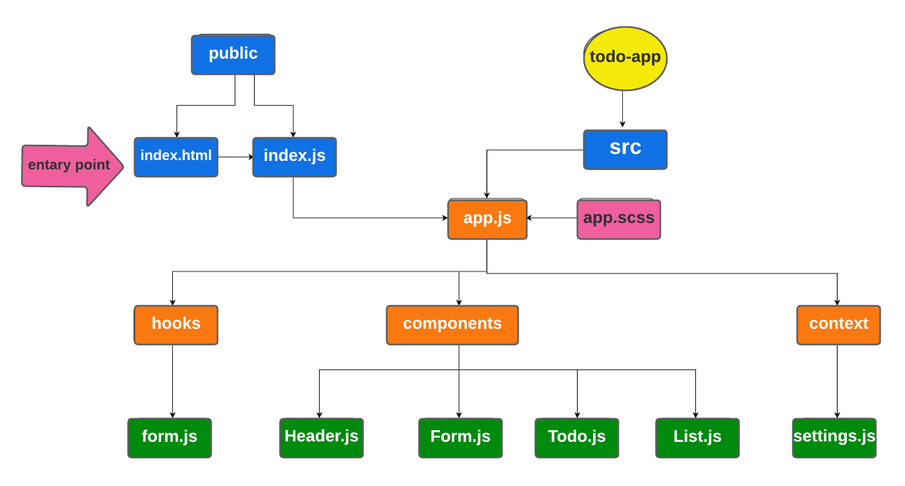

# TO-DO-app

## Author : Saleem Diab 

## LAB 31 - Context API

## Description :

* ### one way of using global states in React by using context API. that done by creating, providing, wrapping, and consumming the context.

* ### useForm is a custom hook that contains a function that will be called when you click on the submit button, and will handle onSumbit and onchange functions.

##  TO-DO App Phase 1:

### In Phase 1, we’re going to perform some refactoring of the To Do application as built by another team. This application mixes application state and user settings at the top level and passes things around. It was a good proof of concept, but we need to make this production ready.

1. adding a global state by context-API
2. adding a pagination.
3. adding style from BluePrint UI.

## Links and Resources:

* ### [code sand box /Phase 1](https://codesandbox.io/s/agitated-lamport-8xyty)

* ### [lab 31 pull request ](https://github.com/saleem-ux/todo-app/pull/2)

## UML : 

